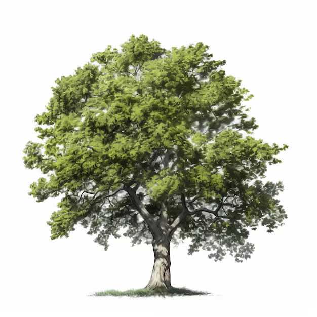
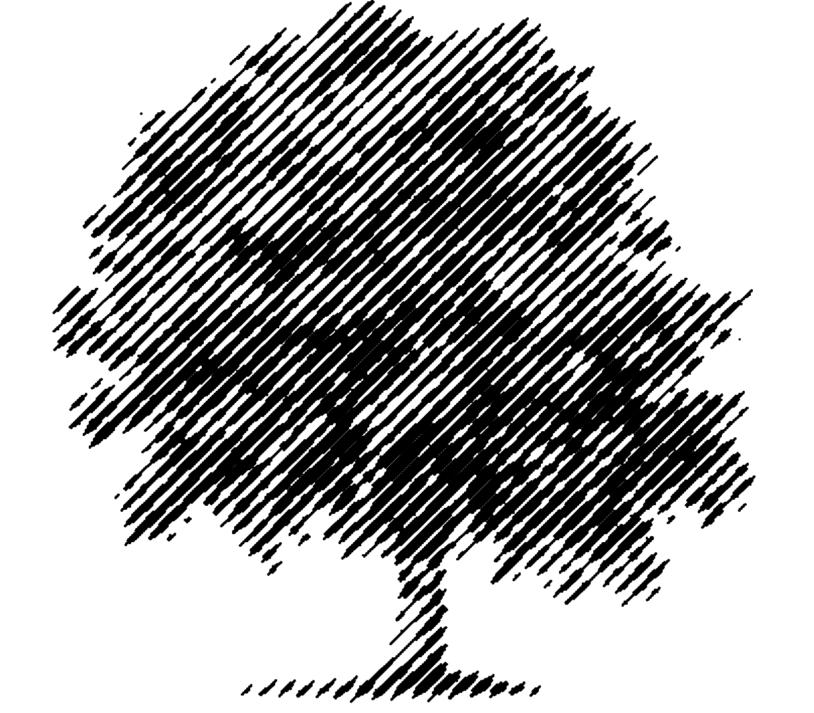
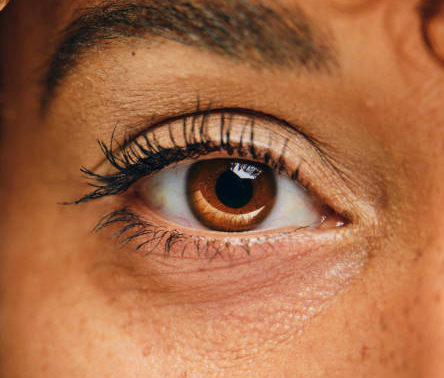
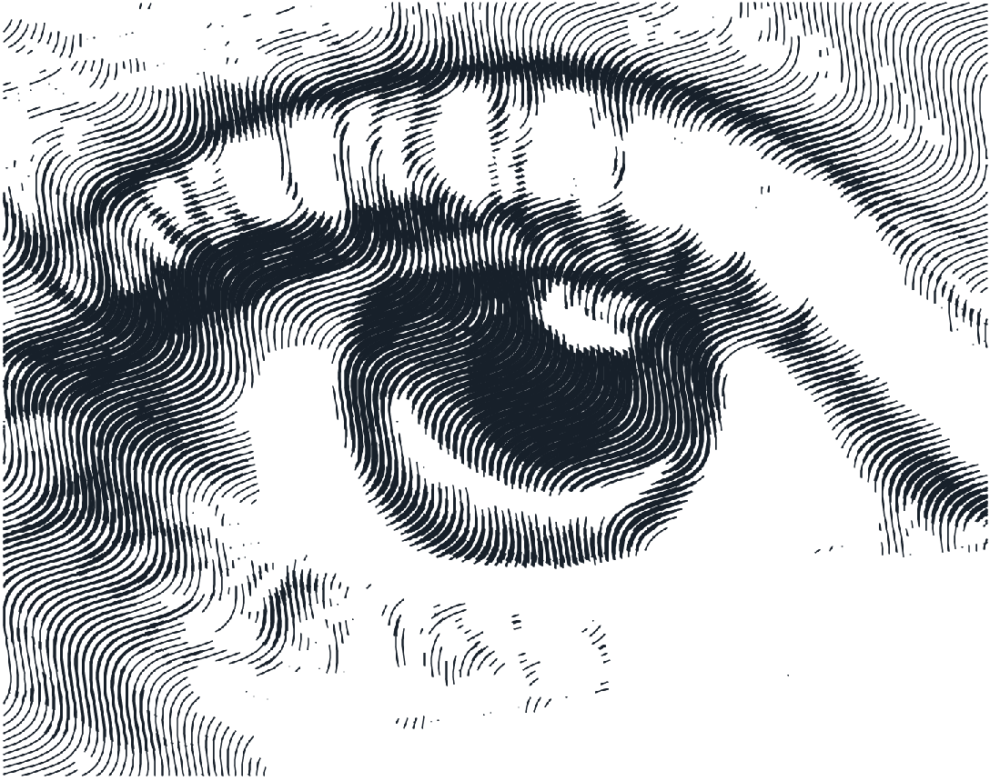
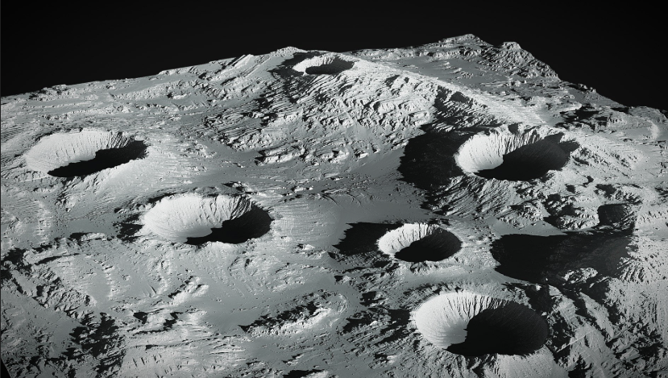
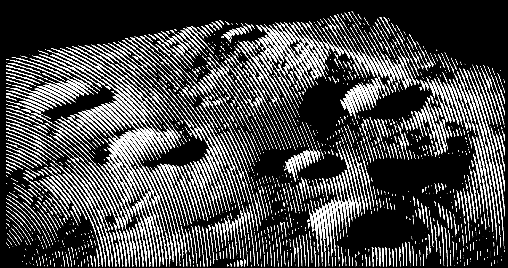
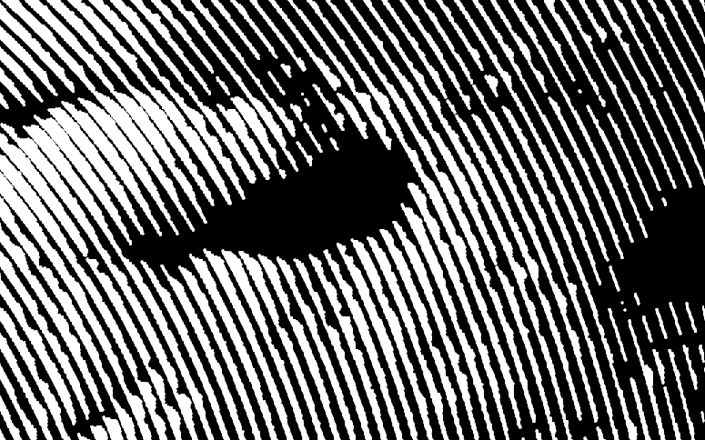

# image_lines

Processing sketch that converts an image into a stippled line drawing by modulating the **amplitude or spacing of lines** based on pixel brightness.

---

## Examples

### Tree — straight lines at 45°

| Source | Result |
|--------|--------|
|  |  |

**Mode:** Straight · **direction=**`-44.4°` · **size=**`1144` · **spacing=**`1.13` · **precision=**`3.60`  
**Threshold:** `use_power` · `mirror` · `black` · `nb_values=6` · `power=-0.13` · range `0–229.5`

---

### Eye — sinus lines

| Source | Result |
|--------|--------|
|  |  |

**Mode:** Sinus · **direction=**`-57.6°` · **size=**`587` · **spacing=**`0.63` · **amplitude=**`20` · **period=**`140.5`  
**Threshold:** `use_power` · `mirror` · `black` · `nb_values=6` · `power=-0.13` · range `0–129.2`

---

### Moon — circle lines

| Source | Result |
|--------|--------|
|  |  |

**Mode:** Circle · **min_radius=**`0` · **max_radius=**`1890` · **center=**`(-960, 493)` · **spacing=**`1.0` · **precision=**`1.44`  
**Threshold:** `use_power` · `nb_values=11` · `power=-0.33` · range `74.8–255` · bright areas drawn (black off) · black background

close up : 

---

## Principle

A set of lines is generated across the canvas — straight, circular, or sinusoidal. Each line is then filtered by the **threshold system**: segments whose underlying pixel brightness falls above or below a set of thresholds are kept or discarded, making the line visible in dark areas and invisible in bright ones (or the reverse).

The result is a plotter-ready vector drawing where the image is encoded in the presence or absence of line segments.

---

## Line Modes

Three curve types are available, selectable via a radio button in the Lines tab:

### Straight Lines

Parallel lines at an arbitrary angle.

| Parameter | Role |
|-----------|------|
| `direction` | Angle of the lines in degrees (−90 to 90). Shortcuts: `---` `///` `|||` `\\\` |
| `size` | Half-length of the lines (radius around the canvas centre) |

### Circle Lines

Concentric ellipses (or circles) around a configurable centre.

| Parameter | Role |
|-----------|------|
| `min_radius` | Radius of the innermost circle |
| `max_radius` | Radius of the outermost circle |
| `center_x` / `center_y` | Offset of the centre from the canvas centre |
| `ellipse` | Ellipse ratio: `0` = perfect circle, positive/negative = stretched |

### Sinus Lines

Sinusoidal waves, parallel, at an arbitrary angle.

| Parameter | Role |
|-----------|------|
| `direction` | Angle of the wave propagation |
| `size` | Half-length (radius) |
| `amplitude` | Peak-to-peak amplitude of the wave |
| `period` | Wavelength of the sinusoid |

---

## Common Lines Parameters

| Parameter | Role |
|-----------|------|
| `lines_spacing` | Distance between adjacent lines |
| `precision` | Step size along each line when sampling pixels (lower = smoother, slower) |
| `nb_lines` | Computed automatically from `size` and `lines_spacing` |

---

## Threshold Filter

The threshold system controls which segments of each line are drawn, based on pixel brightness.

| Parameter | Role |
|-----------|------|
| `nb_values` | Number of threshold levels (1 to 12) |
| `threshold_1` … `threshold_12` | Individual brightness cutoffs for each band |
| `black` | If on, draw segments in dark areas; if off, draw in bright areas |
| `mirror` | Mirror the threshold pattern symmetrically |
| `use_power` | Replace manual thresholds with a power-curve distribution between `min_value` and `max_value` |
| `power` | Curve exponent: `0` = linear, `> 0` = concentrated toward bright, `< 0` = concentrated toward dark |
| `min_value` / `max_value` | Tonal range clamp before threshold evaluation |

With `nb_values > 1`, multiple threshold bands create alternating drawn/undrawn segments — similar to a halftone screen effect.

---

## Architecture

| File | Role |
|------|------|
| `image_lines.pde` | Setup, draw loop, export |
| `DataGlobal.pde` | `ImgProcData` — aggregates image, lines, threshold, style |
| `LinesData.pde` | `DataLines` + `LinesGUI` — common line parameters and tab |
| `StraightLines.pde` | Straight line geometry and UI |
| `CircleLines.pde` | Circular / ellipse geometry and UI |
| `SinusLines.pde` | Sinusoidal line geometry and UI |
| `ImageLinesGenerator.pde` | Abstract generator — polyline accumulation and clipping |
| `ThresholdFilter.pde` | `DataThreshold` + `ThresholdGUI` — brightness-based segment filtering |
| `DataGUI.pde` | `DataGUI` — assembles the 5 tabs (Files, Image, Lines, Threshold, Style) |

---

## Implementation Details

### Line Generation

Each mode computes a set of `ImageLine` objects (polylines). Points are sampled along each line at `precision`-pixel intervals. Each line is assigned a `group_id` so the threshold filter can treat all segments from the same original line consistently.

### Threshold Filtering

After generation, `ThresholdFilter` walks each line segment by segment, samples the pixel brightness at the midpoint, and decides whether to draw it based on the active threshold band(s). The result is a new set of polylines containing only the visible segments.

### Clipping

Optional rectangular clipping is applied as a post-processing step after generation, preserving `group_id` across clipped sub-segments.

### Export

Supports PDF, SVG, and DXF export (plotter-ready).

---

## Usage Tips

- **Straight lines at 45°** with tight spacing give a classic engraving look.
- **Circle lines** centred on an eye or face follow the natural contours and produce a striking result.
- **Sinus lines** add organic texture; keep amplitude small relative to spacing for subtle modulation.
- `use_power` + a negative `power` value concentrates thresholds in the shadows, useful for high-contrast portraits.
- `mirror = true` with `nb_values = 3–5` creates a symmetric band pattern that reads well at plotter scale.
- Lower `precision` (e.g. 0.5–1.0) is needed for smooth circles at large radii; higher values (3–5) are fine for straight lines.

---

## Changelog

### 2026-05-10
- **README**: initial documentation.
